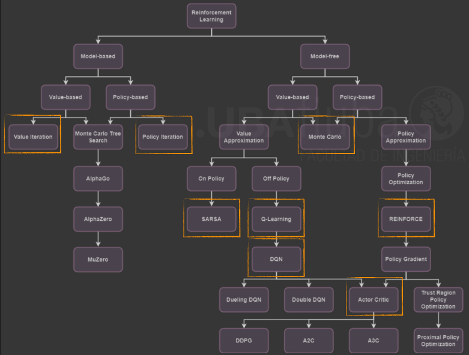

Aprendizaje por Refuerzo 1 - MIA - UBA


# Curso de Aprendizaje por Refuerzo 1 📘🤖
¡Bienvenido a este repositorio del curso de Aprendizaje por Refuerzo 1! Aquí encontrarás material teórico, notebooks con ejemplos prácticos y datasets.


## 📂 Estructura del Repositorio
- `docs/` → Contiene documentos PDF del curso.
- `src/` → Código fuente y notebooks de Jupyter.
- `datasets/` → Conjuntos de datos utilizados.
- `images/` → Gráficos y esquemas para documentación.


## 📜 Requisitos
Para instalar las dependencias necesarias, ejecuta (si corresponde):
```bash
pip install -r requirements.txt
```

## 🎓 Contenido del Curso
1. **Introducción al Aprendizaje por Refuerzo**
2. **Procesos de Decisión de Markov (MDP)**
3. **Programación Dinámica**
4. **Métodos de Monte Carlo**
5. **Métodos de diferencia temporal**
6. **Bibliotecas para aprendizaje por refuerzo**
7. **Deep Q-Network**
8. **Métodos de Gradiente de Política**


## 🧠 Tecnicas de Aprendizaje por Refuerzo
<p align="center">
  
</p>


## 📄 Bibliografía
R. S. Sutton and A. G. Barto, Reinforcement Learning: An Introduction, 2nd ed. Cambridge, MA, USA: MIT Press, 2018.

Cypher, A., & Halbert, D. C. (Eds.). (1993). Watch what I do: programming by demonstration. MIT press. ISO 690.

Bain, M. and Sommut, C., 1999. A framework for behavioural claning. Machine In- telligence 15, 15:103.

Schaal, S. Learning from demonstration. In Advances in neural information processing systems, pages 1040–1046, 1997. 

S. Russell, "Learning agents for uncertain environments (extended abstract)," Proceedings of the 11th Annual Conference on Computational Learning Theory (COLT'98), Madison, WI, USA, 1998, pp. 101–103. doi: 10.1145/279943.279964.

Ng, A. Y., & Russell, S. (2000). "Algorithms for inverse reinforcement learning." Proceedings of the Seventeenth International Conference on Machine Learning (ICML), vol. 1, no. 2, p. 2.

S. Wang, S. Zhang, J. Zhang, R. Hu, X. Li, T. Zhang, et al., “Reinforcement Learning Enhanced LLMs: A Survey,” arXiv preprint arXiv:2412.10400, 2024.

J. Schulman, F. Wolski, P. Dhariwal, A. Radford, and O. Klimov, “Proximal Policy Optimization Algorithms,” arXiv preprint arXiv:1707.06347, 2017.

Hillier, F. S. Lieberman, G. J. (2010). Introducción a la Investigación de Operaciones.

D. Guo et al., "DeepSeek-R1: Incentivizing reasoning capability in LLMs via reinforcement learning," arXiv preprint arXiv:2501.12948, 2025.

Howard, R. A. (1960). Dynamic programming and Markov processes.

Puterman, M. L.: Markov Decision Processes: Discrete Stochastic Dynamic Programming. Wiley (1994).

Bellman, R. E.: Dynamic Programming. Princeton University Press (1957).

S. Wang, S. Zhang, J. Zhang, R. Hu, X. Li, T. Zhang, et al., “Reinforcement Learning Enhanced LLMs: A Survey,” arXiv preprint arXiv:2412.10400, 2024.

J. Schulman, F. Wolski, P. Dhariwal, A. Radford, and O. Klimov, “Proximal Policy Optimization Algorithms,” arXiv preprint arXiv:1707.06347, 2017.

Hillier, F. S. Lieberman, G. J. (2010). Introducción a la Investigación de Operaciones.

D. Guo et al., "DeepSeek-R1: Incentivizing reasoning capability in LLMs via reinforcement learning," arXiv preprint arXiv:2501.12948, 2025.

https://www.youtube.com/watch?v=eRwTbRtnT1I (Learning to drive in a day)

A. Kendall et al., "Learning to drive in a day," 2019 International Conference on Robotics and Automation (ICRA), Montreal, QC, Canada, 2019, pp. 8248-8254, doi: 10.1109/ICRA.2019.8793742. https://ieeexplore.ieee.org/abstract/document/8793742

https://www.youtube.com/watch?v=VMp6pq6_QjI (AI Learns to Park - Deep Reinforcement Learning)

Mahmood, A. R., Korenkevych, D., Komer, B. J., & Bergstra, J. (2018, October). Setting up a reinforcement learning task with a real-world robot. In 2018 IEEE/RSJ International Conference on Intelligent Robots and Systems (IROS) (pp. 4635-4640). IEEE.

Watkins, 1989

Watkins, C. J. C. H., and Dayan, P. 1992. Q-learning. Machine Learning 8(3):279–29

https://basimkhajwal.github.io/RL-Playground/

https://github.com/basimkhajwal/RL-Playground

Schulman, J. (2015). Trust Region Policy Optimization. arXiv preprint arXiv:1502.05477.

Richard S Sutton, David A McAllester, Satinder P Singh, Yishay Mansour, et al. Policy gradient methods for reinforcement learning with function approximation. In Advances in Neural Information Processing Systems (NIPS), volume 99, pp. 1057–1063, 1999. 

David Silver, Guy Lever, Nicolas Heess, Thomas Degris, Daan Wierstra, and Martin Riedmiller. Deterministic policy gradient algorithms. In International Conference on Machine Learning (ICML), 2014. 

Timothy P Lillicrap, Jonathan J Hunt, Alexander Pritzel, Nicolas Heess, Tom Erez, Yuval Tassa, David Silver, and Daan Wierstra. Continuous control with deep reinforcement learning. International Conference on Learning Representations (ICLR), 2016. 

Ronald J Williams. Simple statistical gradient-following algorithms for connectionist reinforcement learning. Machine learning, 8(3-4):229–256, 1992. 

Christopher JCH Watkins and Peter Dayan. Q-learning. Machine learning, 8(3-4):279–292, 1992. 
