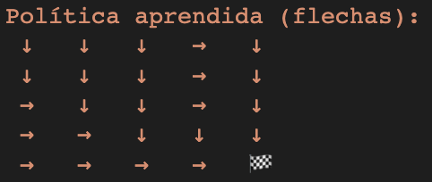
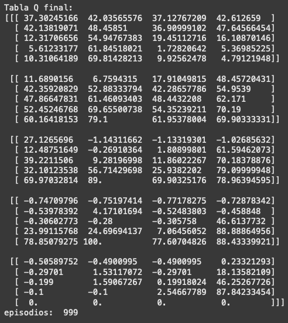
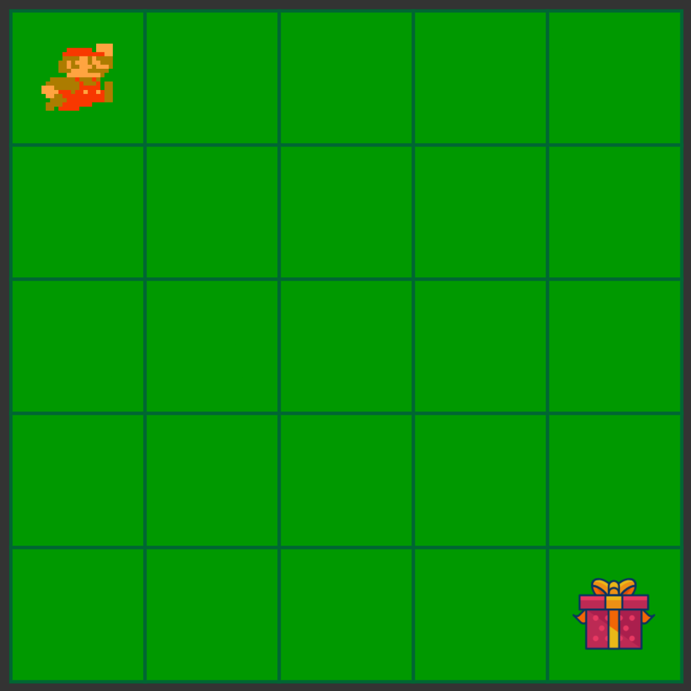
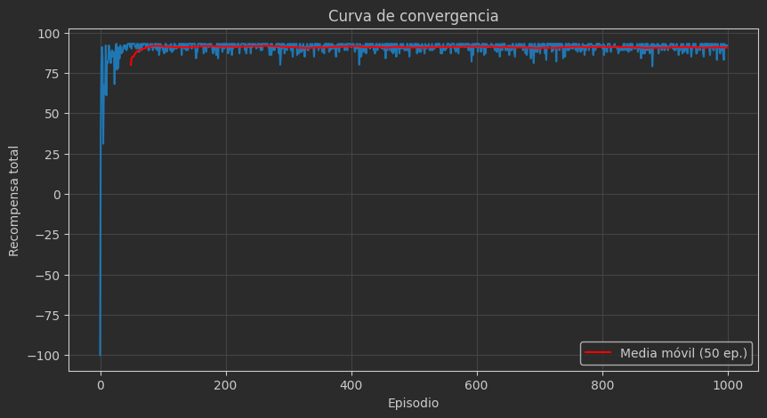

¿Cómo se lee la tabla?

Por ejemplo, esta fila:
[[ 37.30245166  42.03565576  37.12767209  42.612659  ]

corresponde al estado (0,0) (esquina superior izquierda). Cada número en la lista representa:

    Q[0, 0, 0]: valor de tomar la acción "arriba" (aunque en ese borde no se puede).

    Q[0, 0, 1]: valor de "abajo".

    Q[0, 0, 2]: valor de "izquierda" (también borde).

    Q[0, 0, 3]: valor de "derecha".

Entonces, en (0,0), las acciones abajo (1) y derecha (3) tienen los valores más altos (~42.0 y ~42.6), lo cual tiene sentido: desde (0,0) solo puedes avanzar hacia abajo o a la derecha, y ambos llevan eventualmente a la meta.

🏁 ¿Qué pasa con la meta (4,4)?

Consideremos esta entrada:
[  0.   0.   0.   0. ]

corresponde a Q[4,4]. Es decir, no hay valor futuro desde la meta, porque una vez que se llega ahí, el episodio termina. Por eso los valores son cero.

Valores negativos o cercanos a 0

Cuando existen en la tabla valores como -0.68 o 0.43, significa que esas acciones llevan a caminos poco prometedores o sin recompensa (muy lejos de la meta), por lo tanto el algoritmo aprendió que no son buenas opciones.

